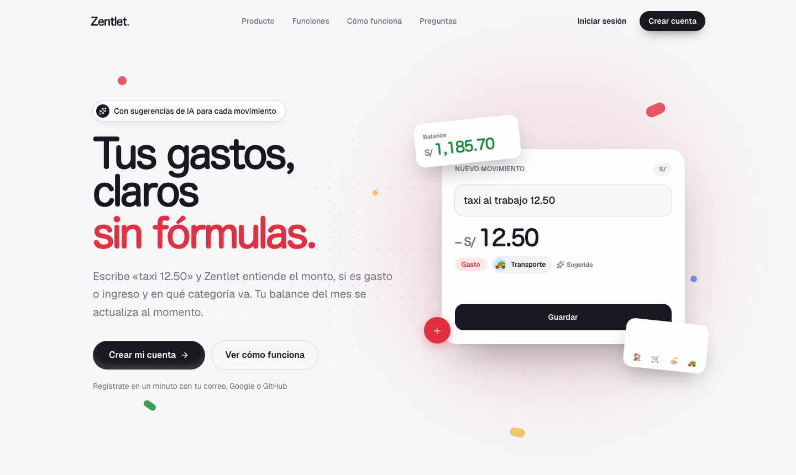
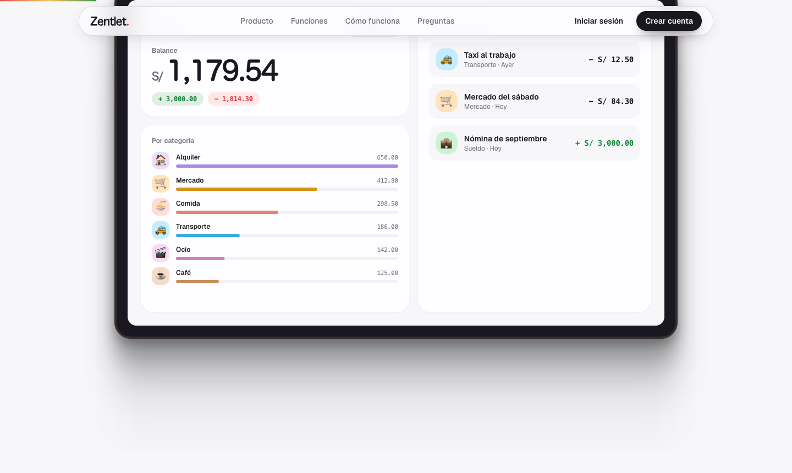
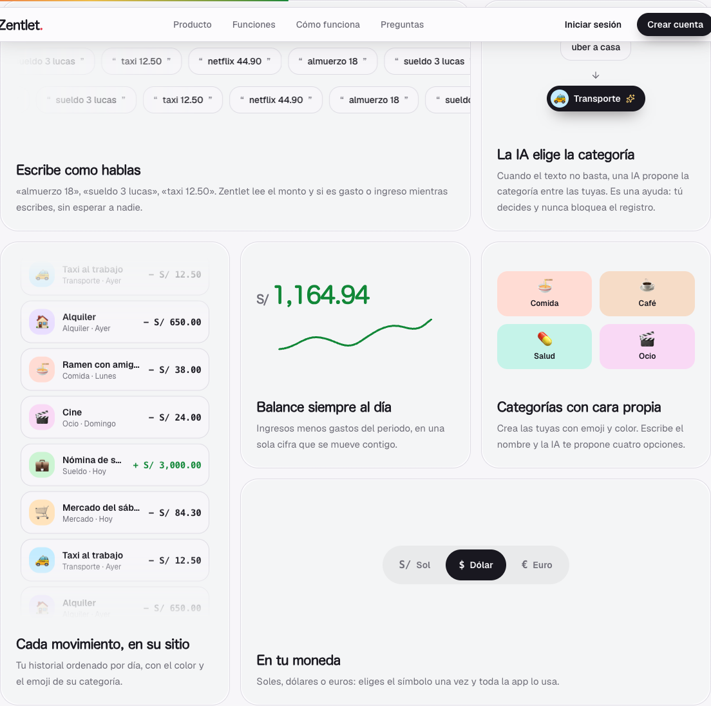
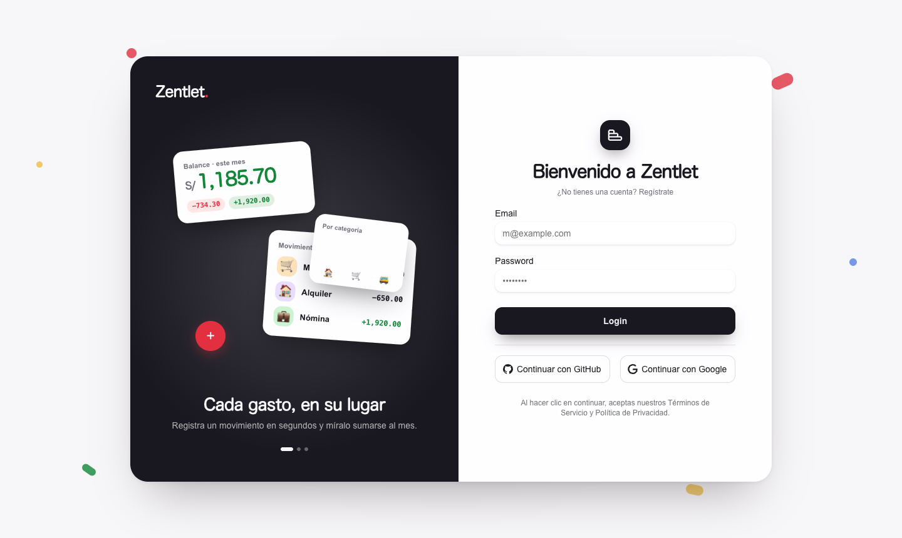
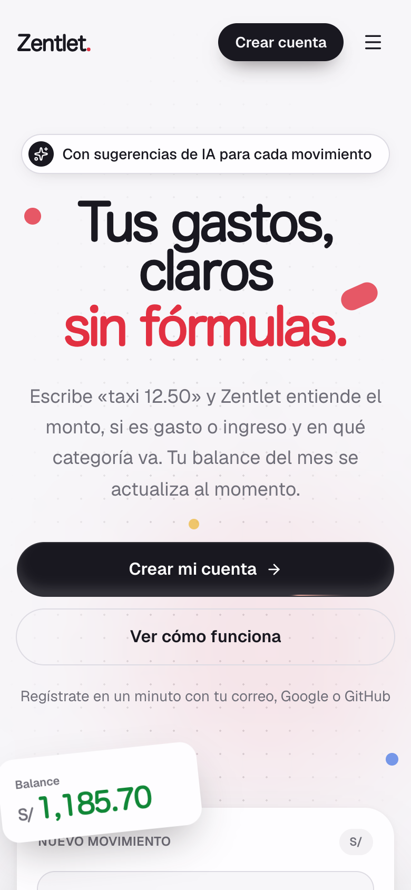
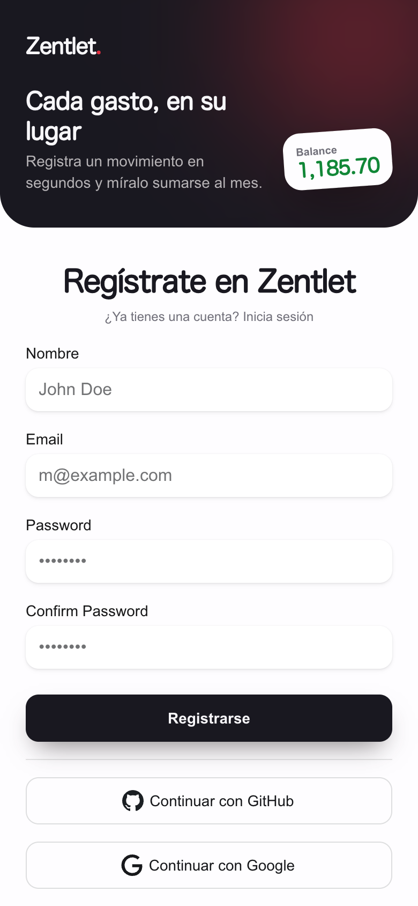
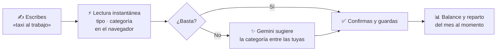

<div align="center">

# Zentlet<span>.</span>

### Tus gastos, claros en segundos.

Escribe **«taxi al trabajo»** y Zentlet entiende si es gasto o ingreso y en qué categoría va.<br/>
Tu balance del mes se actualiza al momento. Sin hojas de cálculo. Sin fórmulas.

<br/>

[](https://nextjs.org)
[](https://react.dev)
[](https://www.typescriptlang.org)
[](https://tailwindcss.com)
[](https://www.prisma.io)
[](https://ai.google.dev)

<br/>



<br/>

[**Funciones**](#-lo-que-hace-zentlet) · [**Capturas**](#-así-se-ve) · [**Cómo funciona**](#-cómo-funciona) · [**Empezar**](#-empezar-en-local) · [**Arquitectura**](#-arquitectura)

</div>

<br/>

## ✦ El problema

Las hojas de cálculo se abandonan en la segunda semana. Anotar un gasto exige abrir un archivo, buscar la fila, elegir la categoría y escribir la fórmula, así que acaba sin anotarse.

**Zentlet está hecho para que anotar un gasto sea más rápido que olvidarlo.** Escribes el gasto como lo dirías, y la app sugiere el tipo y la categoría por ti.

<br/>

## ⚡ Lo que hace Zentlet

<table>
<tr>
<td width="50%" valign="top">

### ⌨️ Escribe como hablas
`almuerzo con amigos` · `sueldo de septiembre` · `taxi al trabajo`

Mientras escribes, Zentlet reconoce **si es gasto o ingreso y la categoría**, al instante y sin llamar a ningún servidor. El monto va en su propio campo.

</td>
<td width="50%" valign="top">

### ✨ La IA pone la categoría
Cuando el texto no basta, **Gemini propone la categoría** entre las que tú creaste. Es una ayuda: tú decides y nunca bloquea el registro.

</td>
</tr>
<tr>
<td valign="top">

### 📊 Tu mes, de un vistazo
Balance, ingresos, gastos y **reparto por categoría** en una sola pantalla. Toca una categoría y filtra al instante.

</td>
<td valign="top">

### 🎨 Categorías con cara propia
Cada categoría tiene **su emoji y su color**. Escribe el nombre y la IA te propone cuatro combinaciones.

</td>
</tr>
<tr>
<td valign="top">

### 💱 En tu moneda
Soles (`S/`), dólares (`$`) o euros (`€`). Lo eliges una vez y toda la app lo usa.

</td>
<td valign="top">

### 🔐 Tus datos son tuyos
Acceso con **correo, Google o GitHub**. Cada consulta exige tu sesión y solo devuelve tus movimientos.

</td>
</tr>
</table>

<br/>

## 📸 Así se ve

<div align="center">



<sub><b>Tu mes completo:</b> balance, reparto por categoría y últimos movimientos.</sub>

<br/><br/>



<sub><b>Cada función, animada.</b> La landing muestra el producto en acción, no en capturas estáticas.</sub>

<br/><br/>



<sub><b>Acceso con carácter:</b> la tarjeta se inclina siguiendo al puntero y el cambio entre login y registro es una transición animada, sin recargar la página.</sub>

<br/><br/>


&nbsp;&nbsp;


<sub><b>Móvil primero.</b> En pantallas pequeñas la escena se aplana: pantalla completa, sin tarjetas que estorben.</sub>

</div>

<br/>

## 🧭 Cómo funciona



1. **Lectura local, instantánea.** Un parser en el cliente ([`parse-description.ts`](src/features/transaction/lib/parse-description.ts)) extrae el tipo y la categoría cuyo nombre aparece en el texto, sin esperar a la red.
2. **La IA afina lo que falta.** Una *server action* pide a Gemini la categoría más probable entre las tuyas, con salida validada por Zod. Si el modelo falla, el alta sigue igual.
3. **Todo se recalcula al guardar.** El balance, los totales y el gráfico por categoría se actualizan al instante con TanStack Query.

<br/>

## 🛠️ Stack

| Capa | Tecnología |
|---|---|
| **Framework** | Next.js 16 (App Router, Turbopack) · React 19 |
| **Estilos** | Tailwind CSS v4 · tokens `oklch` propios · HeroUI v3 |
| **Animación** | Motion (Framer Motion) · componentes de [Magic UI](https://magicui.design) y [Aceternity UI](https://ui.aceternity.com) |
| **Datos** | PostgreSQL · Prisma 7 · TanStack Query |
| **Auth** | Better Auth (correo y contraseña, Google, GitHub) |
| **IA** | Vercel AI SDK · Google Gemini 2.5 Flash |
| **Validación** | Zod 4 · React Hook Form |

<br/>

## 🚀 Empezar en local

**Requisitos:** Node.js 20+, [pnpm](https://pnpm.io) y una base de datos PostgreSQL.

```bash
# 1. Clona e instala
git clone https://github.com/cesarcunyarache/zentlet-next.git
cd zentlet-next
pnpm install

# 2. Configura el entorno
cp .env.example .env        # y rellena los valores (ver tabla abajo)

# 3. Crea las tablas y genera el cliente de Prisma
pnpm prisma migrate dev

# 4. Arranca
pnpm dev
```

Abre **[localhost:3000](http://localhost:3000)**: verás la landing. Crea tu cuenta desde **Crear cuenta**.

### Variables de entorno

| Variable | Para qué sirve | Obligatoria |
|---|---|:---:|
| `DATABASE_URL` | Conexión a PostgreSQL | ✅ |
| `BETTER_AUTH_SECRET` | Firma de sesiones. Genera una con `openssl rand -base64 32` | ✅ |
| `BETTER_AUTH_URL` | URL base de la app (servidor) | ✅ |
| `NEXT_PUBLIC_BETTER_AUTH_URL` | La misma URL, para el cliente de auth | ✅ |
| `GOOGLE_GENERATIVE_AI_API_KEY` | Clave de Gemini para las sugerencias de IA | ✅ |
| `NEXT_PUBLIC_SITE_URL` | URL pública: canonical, sitemap y Open Graph | En producción |
| `GOOGLE_CLIENT_ID` / `GOOGLE_CLIENT_SECRET` | Acceso con Google | Opcional |
| `GITHUB_CLIENT_ID` / `GITHUB_CLIENT_SECRET` | Acceso con GitHub | Opcional |
| `NEXT_PUBLIC_API_URL` | Backend separado; vacío = mismo origen | Opcional |

### Scripts

| Comando | Qué hace |
|---|---|
| `pnpm dev` | Servidor de desarrollo |
| `pnpm build` | Build de producción (la landing se genera como página estática) |
| `pnpm start` | Sirve el build |
| `pnpm lint` | ESLint |

<br/>

## 🧱 Arquitectura

Organizado **por funcionalidad**: cada feature trae sus componentes, servicios, esquemas, stores y prompts de IA.

```
src/
├── app/                      # Rutas (App Router)
│   ├── page.tsx              # Landing: metadata, JSON-LD
│   ├── admin/                # App privada: categorías y movimientos
│   ├── auth/                 # Login y registro con transición animada
│   ├── api/                  # Endpoints REST (categorías, movimientos, auth)
│   ├── robots.ts · sitemap.ts · opengraph-image.tsx
├── features/
│   ├── landing/              # Landing: secciones y contenido por idioma
│   │   └── content/          # ← todo el texto de la página, tipado
│   ├── transaction/          # Movimientos: parser, IA, store, UI
│   └── category/             # Categorías: generador de iconos con IA
├── core/components/ui/       # Primitivas animadas (Magic UI, Aceternity)
├── lib/                      # Auth, Prisma, IA, easing, config del sitio
└── generated/prisma/         # Cliente de Prisma generado
```

### Decisiones que vale la pena conocer

- **🌍 Lista para traducir.** Todo el copy de la landing vive en [`features/landing/content/es.ts`](src/features/landing/content/es.ts), tipado con `LandingContent`. Para un nuevo idioma, crea `en.ts` y regístralo en `content/index.ts`. Si a una traducción le falta un texto, no compila.
- **🔎 SEO de serie.** La landing es una página estática con metadata completa, datos estructurados (`SoftwareApplication` + `FAQPage`), `sitemap.xml`, `robots.txt` y una imagen Open Graph generada en el build.
- **♿ Movimiento responsable.** Todas las animaciones respetan `prefers-reduced-motion`. Las demos decorativas están ocultas para lectores de pantalla y el titular se ve sin JavaScript.
- **🎨 Un único origen de color.** Los tokens `--app-*` en [`globals.css`](src/app/globals.css) definen toda la paleta; los componentes nunca usan colores literales.

<br/>

## 🗺️ Próximos pasos

- [ ] Testimonios de los primeros usuarios (la sección ya está lista en `content/es.ts`)
- [ ] Traducción al inglés
- [ ] Textos de los formularios de acceso en español y errores bajo cada campo

<br/>

<div align="center">

**Zentlet<span>.</span>** · Hecho para que anotar sea más rápido que olvidar.

</div>
