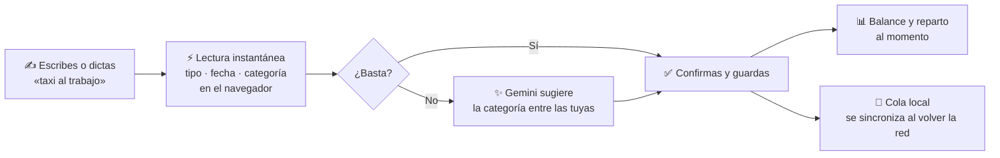

<div align="center">

# Zentlet<span>.</span>

### Tus gastos, claros en segundos.

Escribe **«taxi al trabajo»** o dilo en voz alta, y Zentlet entiende si es gasto o ingreso y en qué categoría va.<br/>
Tu balance del mes se actualiza al momento, también sin conexión. Sin hojas de cálculo. Sin fórmulas.

<br/>

[](https://nextjs.org)
[](https://react.dev)
[](https://www.typescriptlang.org)
[](https://tailwindcss.com)
[](https://www.prisma.io)
[](https://ai.google.dev)
[](.github/workflows/ci.yml)

<br/>


<br/>

[**Funciones**](#-lo-que-hace-zentlet) · [**Capturas**](#-así-se-ve) · [**Cómo funciona**](#-cómo-funciona) · [**Empezar**](#-empezar-en-local) · [**Arquitectura**](#-arquitectura) · [**Seguridad**](#-seguridad-y-privacidad) · [**Producción**](#-desplegar-a-producción)

</div>

<br/>

## ✦ El problema

Las hojas de cálculo se abandonan en la segunda semana. Anotar un gasto exige abrir un archivo, buscar la fila, elegir la categoría y escribir la fórmula, así que acaba sin anotarse.

**Zentlet está hecho para que anotar un gasto sea más rápido que olvidarlo.** Escribes o dictas el gasto como lo dirías, y la app completa el tipo, la fecha y la categoría por ti.

<br/>

## ⚡ Lo que hace Zentlet

<table>
<tr>
<td width="50%" valign="top">

### ⌨️ Escribe como hablas
`almuerzo con amigos` · `sueldo de septiembre` · `taxi al trabajo`

Mientras escribes, Zentlet reconoce **si es gasto o ingreso y la categoría**, al instante y sin llamar a ningún servidor. El monto va en su propio campo.

</td>
<td width="50%" valign="top">

### 🎙️ O díctalo
*«Ayer gasté 35 soles en almuerzo»* · *«Spent 12.50 on lunch yesterday»*

Toca el micrófono y Zentlet extrae **monto, fecha y categoría** del dictado. Entiende español e inglés, cifras como «2.500», «3 mil» o «35 con 50», y fechas como «ayer» o «el lunes».

</td>
</tr>
<tr>
<td valign="top">

### ✨ La IA pone la categoría
Cuando el texto no basta, **Gemini propone la categoría** entre las que tú creaste. Es una ayuda: tú decides y nunca bloquea el registro.

</td>
<td valign="top">

### 📊 Tu mes, de un vistazo
Balance, ingresos, gastos y **reparto por categoría** en una sola pantalla. Toca una categoría y filtra al instante.

</td>
</tr>
<tr>
<td valign="top">

### 📴 Funciona sin conexión
Registra, edita y borra aunque no tengas internet. Los cambios se guardan en el dispositivo y **se sincronizan solos** al volver la red, aunque hayas cerrado la app. Se instala como app (PWA).

</td>
<td valign="top">

### 🎨 Categorías con cara propia
Cada categoría tiene **su emoji y su color**. Escribe el nombre y la IA te propone cuatro combinaciones.

</td>
</tr>
<tr>
<td valign="top">

### 💱 En tu moneda y tu idioma
Soles (`S/`), dólares (`$`), euros (`€`) o pesos (`$`). La app, los correos y el dictado, **en español o inglés**.

</td>
<td valign="top">

### 📤 Tus datos son tuyos
**Exporta** todos tus movimientos y categorías a **Excel** cuando quieras, o **elimina tu cuenta** y todo lo que contiene desde Ajustes.

</td>
</tr>
<tr>
<td valign="top">

### 👋 Bienvenida en 3 pasos
Las cuentas nuevas ven un recorrido animado que enseña a escribir, dictar y leer el mes, y termina creando su primera categoría. Se muestra **una sola vez**.

</td>
<td valign="top">

### 🔐 Acceso seguro
Correo (con verificación y recuperación de contraseña), **Google o GitHub**. CAPTCHA contra bots y cada consulta devuelve solo tus datos.

</td>
</tr>
</table>

<br/>

## 📸 Así se ve

<div align="center">


<sub><b>Tu mes completo:</b> balance, reparto por categoría y últimos movimientos.</sub>

<br/><br/>


<sub><b>Cada función, animada.</b> La landing muestra el producto en acción, no en capturas estáticas.</sub>

<br/><br/>


<sub><b>Acceso con carácter:</b> la tarjeta se inclina siguiendo al puntero y el cambio entre login y registro es una transición animada, sin recargar la página.</sub>

<br/><br/>


&nbsp;&nbsp;


<sub><b>Móvil primero.</b> En pantallas pequeñas la escena se aplana: pantalla completa, sin tarjetas que estorben.</sub>

</div>

<br/>

## 🧭 Cómo funciona



1. **Lectura local, instantánea.** Los parsers del cliente ([`parse-description.ts`](src/features/transaction/lib/parse-description.ts) al escribir y [`parse-voice.ts`](src/features/transaction/lib/parse-voice.ts) al dictar) extraen tipo, monto, fecha y categoría sin esperar a la red. Cada idioma aporta sus palabras; el procedimiento es el mismo.
2. **La IA afina lo que falta.** Una *server action* pide a Gemini la categoría más probable entre las tuyas, con salida validada por Zod. Si el modelo falla o se agota el cupo, el alta sigue igual.
3. **Todo aparece al instante y se sincroniza por detrás.** Las escrituras son optimistas y viajan por una cola persistida en IndexedDB ([TanStack Query](https://tanstack.com/query) + service worker). Sin conexión quedan en pausa y se reanudan solas. El servidor es **idempotente por id**, así que reenviar un cambio nunca lo duplica.

<br/>

## 🛠️ Stack

| Capa | Tecnología |
|---|---|
| **Framework** | Next.js 16 (App Router, Turbopack) · React 19 · Node.js 24 |
| **Estilos** | Tailwind CSS v4 · tokens `oklch` propios · HeroUI v3 |
| **Animación** | Motion (Framer Motion) · componentes de [Magic UI](https://magicui.design) y [Aceternity UI](https://ui.aceternity.com) |
| **Datos** | PostgreSQL · Prisma 7 · TanStack Query (persistido en IndexedDB) |
| **Auth** | Better Auth: correo y contraseña con verificación, Google, GitHub |
| **IA** | Vercel AI SDK · Google Gemini 2.5 Flash |
| **Validación** | Zod 4 · React Hook Form |
| **Correo** | Resend (verificación y recuperación de contraseña) |
| **Anti-bots** | Cloudflare Turnstile |
| **Exportación** | `write-excel-file` (.xlsx) |
| **Observabilidad** | Sentry · PostHog · Pino — todo opcional, ver [docs/observability.md](docs/observability.md) |
| **Calidad** | Vitest · ESLint · GitHub Actions |

<br/>

## 🚀 Empezar en local

**Requisitos:** Node.js 24 (fijado en `.nvmrc`; con nvm basta `nvm install && nvm use`), [pnpm](https://pnpm.io) y una base de datos PostgreSQL.

```bash
# 1. Clona e instala
git clone https://github.com/cesarcunyarache/zentlet-next.git
cd zentlet-next
pnpm install

# 2. Configura el entorno
cp .env.example .env        # y rellena los valores (ver tabla abajo)

# 3. Crea las tablas y genera el cliente de Prisma
pnpm prisma migrate dev

# 4. Arranca
pnpm dev
```

Abre **[localhost:3000](http://localhost:3000)**: verás la landing. Crea tu cuenta desde **Crear cuenta**. Sin `RESEND_API_KEY`, el correo de verificación **se escribe en la terminal** (`email.dev_outbox`): abre ese enlace para confirmar la cuenta y entrar.

> **¿Todo da 404 con `pnpm dev`?** La caché de Turbopack (`.next/dev`) puede quedarse con una estructura de rutas antigua tras cambios grandes. Detén el servidor, borra `.next/dev` y vuelve a arrancar.

### Variables de entorno

Sólo las cinco primeras son necesarias para desarrollar. El resto activa funciones opcionales; **sin ellas la app funciona igual**.

| Variable | Para qué sirve | Obligatoria |
|---|---|:---:|
| `DATABASE_URL` | Conexión a PostgreSQL | ✅ |
| `BETTER_AUTH_SECRET` | Firma de sesiones (≥ 32 caracteres). Genera una con `openssl rand -base64 32` | ✅ |
| `BETTER_AUTH_URL` | URL base de la app (servidor) | ✅ |
| `NEXT_PUBLIC_BETTER_AUTH_URL` | La misma URL, para el cliente de auth (se fija en el build) | ✅ |
| `GOOGLE_GENERATIVE_AI_API_KEY` | Clave de Gemini para las sugerencias de IA | ✅ |
| `NEXT_PUBLIC_SITE_URL` | URL pública: canonical, sitemap y Open Graph | En producción |
| `RESEND_API_KEY` / `EMAIL_FROM` | Correos de verificación y de recuperación de contraseña. En desarrollo, sin clave, se escriben en la terminal | En producción |
| `NEXT_PUBLIC_TURNSTILE_SITE_KEY` / `TURNSTILE_SECRET_KEY` | CAPTCHA de Cloudflare Turnstile en registro, login, recuperación y reenvío del correo. Se activa sólo con las dos | Recomendado en producción |
| `GOOGLE_CLIENT_ID` / `GOOGLE_CLIENT_SECRET` | Acceso con Google | Opcional |
| `GITHUB_CLIENT_ID` / `GITHUB_CLIENT_SECRET` | Acceso con GitHub | Opcional |
| `NEXT_PUBLIC_API_URL` | Backend separado; vacío = mismo origen | Opcional |
| `SENTRY_DSN` / `NEXT_PUBLIC_SENTRY_DSN` | Errores y trazas en servidor / navegador (Sentry) | Opcional |
| `SENTRY_AUTH_TOKEN` / `SENTRY_ORG` / `SENTRY_PROJECT` | Subida de source maps en el build (el token es secreto) | Opcional |
| `NEXT_PUBLIC_POSTHOG_KEY` / `NEXT_PUBLIC_POSTHOG_HOST` | Estadísticas de uso (PostHog), sólo con el consentimiento del usuario | Opcional |
| `LOG_LEVEL` | Nivel de los logs del servidor (`debug`, `info`, `warn`…) | Opcional |

### Scripts

| Comando | Qué hace |
|---|---|
| `pnpm dev` | Servidor de desarrollo |
| `pnpm build` | Build de producción (landing, acceso y páginas legales se generan estáticas) |
| `pnpm start` | Sirve el build |
| `pnpm lint` | ESLint |
| `pnpm typecheck` | Genera los tipos de rutas de Next y ejecuta `tsc` |
| `pnpm test` | Tests (Vitest); `pnpm test:watch` en modo watch |

Cada push a `master` y cada pull request pasan por el [CI](.github/workflows/ci.yml): lint, typecheck, tests y build, con la misma versión de Node que en local (`.nvmrc`).

<br/>

## 🧱 Arquitectura

Organizado **por funcionalidad**: cada feature trae sus componentes, servicios, esquemas, stores y prompts de IA.

```
src/
├── app/                          # Rutas (App Router)
│   ├── [locale]/                 # Páginas por idioma: /… (es) y /en/…
│   │   ├── page.tsx              # Landing: metadata, JSON-LD, hreflang
│   │   ├── admin/                # App privada: movimientos, categorías, ajustes
│   │   ├── auth/                 # Login, registro, recuperar y restablecer contraseña
│   │   ├── legal/[document]/     # Política de privacidad y Términos (es/en)
│   │   ├── not-found.tsx · error.tsx · [...rest]/   # 404 y errores propios, traducidos
│   │   └── opengraph-image.tsx
│   ├── api/
│   │   ├── transaction/ · category/   # REST idempotente por id
│   │   ├── account/export/       # Descarga en Excel
│   │   ├── account/onboarding/   # Marca la bienvenida como vista
│   │   └── auth/[...all]/        # Better Auth
│   ├── manifest.webmanifest/     # Manifest de la PWA por idioma
│   ├── global-error.tsx · robots.ts · sitemap.ts
├── instrumentation.ts · instrumentation-client.ts   # Arranque opcional de Sentry/PostHog
├── i18n/                         # next-intl: idiomas, carga de mensajes, navegación, tipos
├── locales/                      # Traducciones: <idioma>/<módulo>.json
├── features/
│   ├── landing/                  # Landing: secciones y contenido
│   ├── transaction/              # Movimientos: parsers de texto y voz, IA, store, UI
│   ├── category/                 # Categorías: generador de iconos con IA
│   ├── account/                  # Exportar datos y eliminar cuenta
│   ├── onboarding/               # Bienvenida en 3 pasos
│   └── legal/                    # Textos legales y datos del responsable
├── core/
│   ├── components/               # Formularios de acceso, Turnstile, aviso de estadísticas, UI animada
│   ├── offline/                  # Cola offline, persistencia, datos locales por usuario
│   └── services/                 # Cliente HTTP (Axios)
├── lib/
│   ├── auth.ts · prisma.ts       # Better Auth y Prisma
│   ├── ai/                       # Cliente de Gemini y cupo por usuario
│   ├── email/                    # Envío (Resend) y plantillas es/en
│   ├── observability/            # Logs, errores, analítica (fachada sin acoplar proveedores)
│   └── rate-limit.ts             # Límites de uso en base de datos
└── generated/prisma/             # Cliente de Prisma generado
```

### Decisiones que vale la pena conocer

- **📴 Offline-first.** La cache de TanStack Query se persiste en IndexedDB, una por usuario. Las escrituras hechas sin red quedan en cola y se reanudan al volver, incluso tras cerrar la app. Un 429 del servidor frena la cola, nunca descarta cambios.
- **🔁 Idempotencia por id.** El cliente genera el id de cada movimiento y categoría (`crypto.randomUUID`): reenviar un alta devuelve la existente en lugar de duplicarla, también en carreras entre dos peticiones.
- **🌍 En español e inglés.** Con [next-intl](https://next-intl.dev): el español conserva las URLs de siempre y el inglés vive bajo `/en`. Si a una traducción le falta un texto, no compila. Ver [Idiomas](#-idiomas).
- **🔭 Observabilidad desacoplada.** El código sólo conoce `@/lib/observability/*`; Sentry y PostHog se cargan únicamente si están configurados y nunca bloquean ni rompen una petición. Ver [docs/observability.md](docs/observability.md).
- **🔎 SEO de serie.** La landing es una página estática con metadata completa, datos estructurados (`SoftwareApplication` + `FAQPage`), `sitemap.xml`, `robots.txt` y una imagen Open Graph generada en el build.
- **♿ Movimiento responsable.** Todas las animaciones respetan `prefers-reduced-motion`. Las demos decorativas están ocultas para lectores de pantalla y el titular se ve sin JavaScript.
- **🎨 Un único origen de color.** Los tokens `--app-*` en [`globals.css`](src/app/globals.css) definen toda la paleta, en claro y oscuro; los componentes nunca usan colores literales.

<br/>

## 🔒 Seguridad y privacidad

Zentlet trata datos financieros personales, así que la seguridad es parte del producto:

| Área | Qué hace |
|---|---|
| **Cuentas** | Verificación de correo obligatoria (con reenvío y espera de 60 s), recuperación de contraseña de un solo uso que cierra las demás sesiones, y Google/GitHub sólo se vinculan a cuentas con el correo verificado |
| **Sesión** | Caduca tras **7 días sin uso**; usar la app al menos una vez al día la prorroga. Sin conexión, los datos locales dejan de abrirse cuando la sesión habría caducado |
| **Anti-abuso** | CAPTCHA (Turnstile), límites de intentos de login/registro/correos, cupo de 120 escrituras por minuto, 30 llamadas a la IA por minuto y cuerpos de hasta 16 KB — todo contado en la base de datos, compartido entre instancias |
| **Cabeceras** | HSTS, protección contra clickjacking, `nosniff`, `Referrer-Policy` y `Permissions-Policy` (el micrófono, sólo para la propia app) |
| **Dispositivo compartido** | Al cerrar sesión se borran los datos locales; al entrar otra cuenta, los de las anteriores; las páginas privadas guardadas no se abren sin pasar por el servidor |
| **Consentimiento** | Ingresos y gastos son datos sensibles (Ley 29733): el registro exige una casilla expresa, el servidor la comprueba y guarda fecha y versión aceptadas. Las estadísticas de uso sólo se activan si el usuario las acepta |
| **Derechos del usuario** | Exportar todo a Excel (acceso y portabilidad) y eliminar la cuenta con borrado en cascada (cancelación) |
| **Terceros** | Sentry y PostHog no reciben montos, descripciones, correos ni el texto de búsqueda; a Gemini sólo viajan la descripción y los nombres de categoría, nunca los montos |

La [Política de privacidad](src/features/legal/content.ts) y los Términos siguen la normativa peruana (Ley 29733 y su Reglamento, Código del Consumidor) con cobertura para usuarios de la UE y EE. UU. **Antes de lanzar**, revisa [docs/legal.md](docs/legal.md): hay datos del responsable por completar y obligaciones que no son código.

<br/>

## 🧪 Calidad

- **Tests (Vitest)** sobre lo que más daño haría romper: la cola offline con un `QueryClient` real (alta sin red, reanudación, rechazos, reintentos), los totales con cambios pendientes, la idempotencia de las altas, los parsers de texto y voz en ambos idiomas, la validación de fechas, la exportación, los límites de uso, los correos y la caducidad de la sesión sin conexión.
- **CI en cada push y pull request**: lint, typecheck, tests y build en una copia limpia, sin secretos.
- **Observabilidad lista para producción**: errores de servidor y navegador, trazas, queries lentas, latencia y tokens de la IA, y sincronizaciones rechazadas. Ver [docs/observability.md](docs/observability.md).

<br/>

## 🚢 Desplegar a producción

- [ ] **Node.js 24** en la plataforma (Vercel lo toma de `engines` en `package.json`).
- [ ] **Migraciones**: ejecuta `pnpm prisma migrate deploy` contra la base de datos de producción en cada despliegue con migraciones nuevas.
- [ ] **Base de datos serverless**: usa el pooler en modo transacción (Supabase: puerto `6543`) en `DATABASE_URL`.
- [ ] **Variables**: todas las obligatorias, más `NEXT_PUBLIC_SITE_URL`, Resend (con tu dominio verificado: SPF, DKIM y DMARC) y Turnstile.
- [ ] **OAuth**: callbacks de producción en Google (`/api/auth/callback/google`) y GitHub (`/api/auth/callback/github`), y pantalla de consentimiento de Google publicada.
- [ ] **Legal**: completa [`src/features/legal/config.ts`](src/features/legal/config.ts) y sigue [docs/legal.md](docs/legal.md).
- [ ] **Monitoreo** (opcional): Sentry con alertas y PostHog, según [docs/observability.md](docs/observability.md).

<br/>

## 🌍 Idiomas

Español (`es`, por defecto) e inglés (`en`), con [next-intl](https://next-intl.dev). El español no lleva prefijo (`/`, `/admin`); el resto sí (`/en`, `/en/admin`). El proxy detecta el idioma (cookie `NEXT_LOCALE` o `Accept-Language`) y conserva el prefijo en las redirecciones de auth.

```
src/locales/
├── es/  common · auth · landing · transactions · categories · settings · offline · onboarding
└── en/  (las mismas keys)
```

Un archivo por **módulo**, no por componente. `common.json` sólo guarda lo que usan varios módulos (acciones como Guardar o Cancelar, páginas de error, aviso de estadísticas).

También siguen el idioma de la URL: el **dictado por voz** (reconocimiento y parser), los **correos** de la cuenta, el **Excel** exportado, las **páginas legales** y el **manifest** de la app instalable.

**Usar traducciones**

```tsx
// Client Component
const t = useTranslations("transactions");
t("form.title");
t("list.deleteItem", { name });              // interpolación
t.rich("signIn.noAccount", { link: (c) => <AuthLink href="…">{c}</AuthLink> });

// Server Component (async)
const t = await getTranslations({ locale, namespace: "common" });
```

- Pluralización con ICU en el JSON: `"{count, plural, one {# cambio} other {# cambios}}"`.
- Enlaces y redirecciones con [`@/i18n/navigation`](src/i18n/navigation.ts) (`Link`, `useRouter`, `redirect`, `getPathname`), nunca concatenando el idioma a mano.
- La landing recibe su copy por props desde el servidor: [`content/index.ts`](src/features/landing/content/index.ts) une `landing.json` con los datos de la demo de [`content/data.ts`](src/features/landing/content/data.ts).

**Convenciones**

- Keys semánticas en camelCase (`emptyState`, `form.title`), nunca el texto (`t("Guardar")`). Nada de arrays en los JSON: rompen los tipos de next-intl; usa objetos con claves.
- `es` es la referencia de tipos: `t("key-inexistente")` no compila, y `en` debe tener exactamente las mismas keys ([`i18n/types.ts`](src/i18n/types.ts)).
- **No se traducen** los valores internos: `expense`/`income`, periodos, ids, anclas de la landing, códigos de error de la API, nombres de categorías del usuario, el símbolo de moneda guardado ni los prompts de IA.
- Fechas con `Intl` según el idioma; los montos mantienen el formato `1,250.50` (`intlLocales` en [`i18n/routing.ts`](src/i18n/routing.ts)).

**Agregar un idioma (p. ej. `pt`)**

1. Copia `src/locales/es/` a `src/locales/pt/` y traduce los valores.
2. En [`i18n/routing.ts`](src/i18n/routing.ts), añade `"pt"` a `locales`, a `intlLocales` (`"pt-BR"`) y a `localeNames` (`"Português"`).
3. En [`i18n/types.ts`](src/i18n/types.ts), repite el bloque de comprobación de `en` para `pt`.
4. Añade sus reglas al dictado ([`parse-voice.ts`](src/features/transaction/lib/parse-voice.ts)), a las plantillas de correo ([`email/templates.ts`](src/lib/email/templates.ts)), a los textos legales ([`legal/content.ts`](src/features/legal/content.ts)) y al [manifest](src/app/manifest.webmanifest/route.ts): TypeScript señala cada sitio que falta.
5. `pnpm build`: la landing, el sitemap, hreflang, el selector de idioma y el proxy lo recogen solos.

<br/>

## 🗺️ Próximos pasos

- [ ] Rendimiento de la app privada en móviles de gama media: animaciones de `layout` por fila, lista por tramos y carga diferida de las hojas
- [ ] Actualizar Next.js a 16.3.x y retirar `next-auth` / `@auth/prisma-adapter`, que no se usan
- [ ] Conservar en cola los cambios que reciben un 401 (sesión caducada) en lugar de revertirlos
- [ ] Ejecutar `prisma migrate deploy` automáticamente en el despliegue
- [ ] Pedir el consentimiento legal a las cuentas creadas antes de la casilla
- [ ] Testimonios de los primeros usuarios (la sección ya está lista en `content/data.ts`)

<br/>

<div align="center">

**Zentlet<span>.</span>** · Hecho para que anotar sea más rápido que olvidar.

</div>
