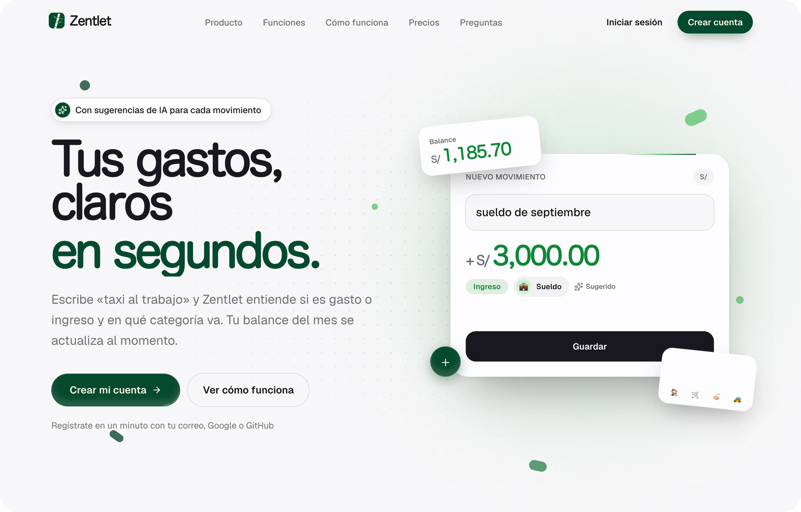
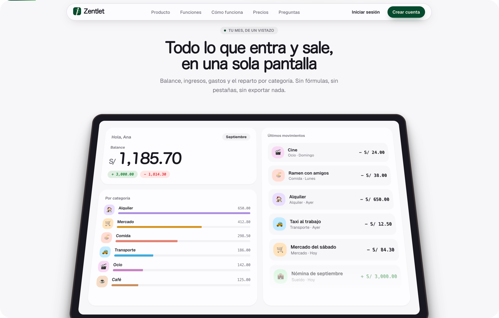
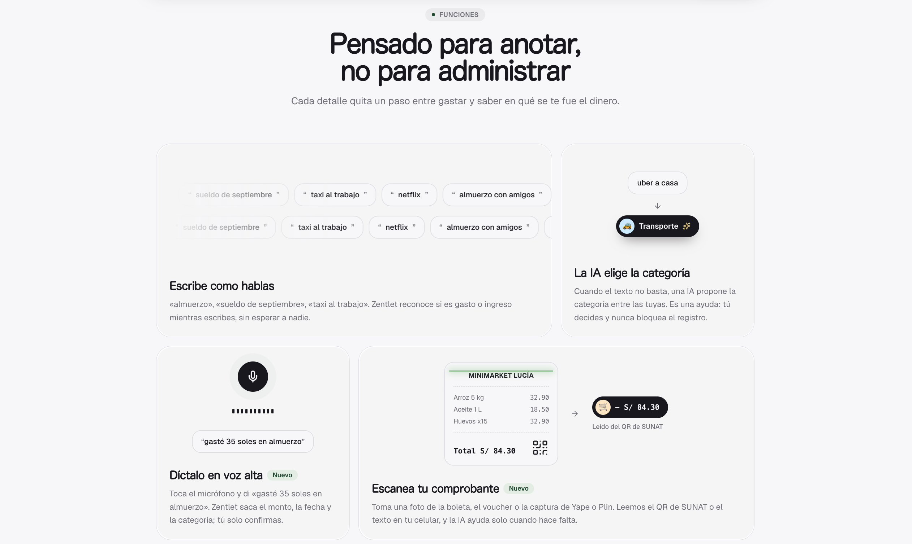
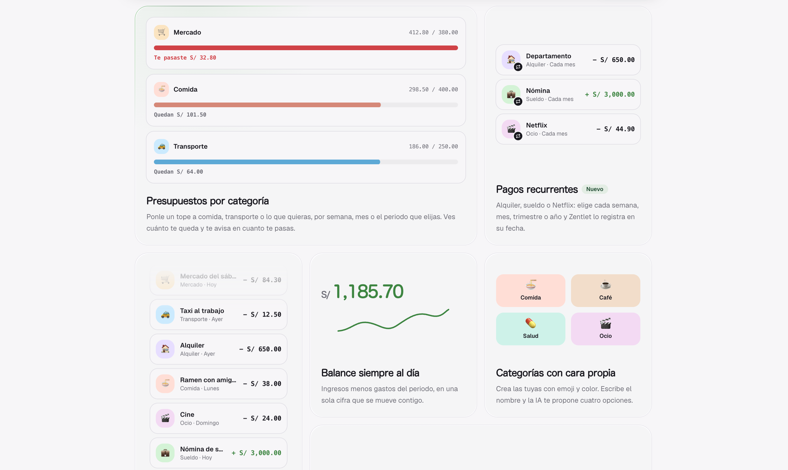
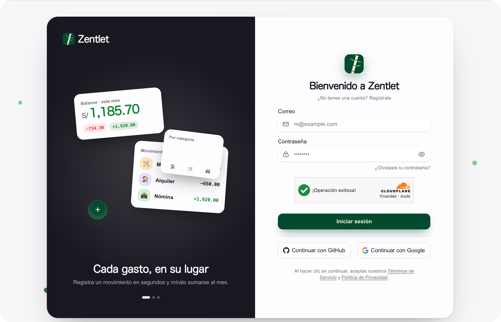
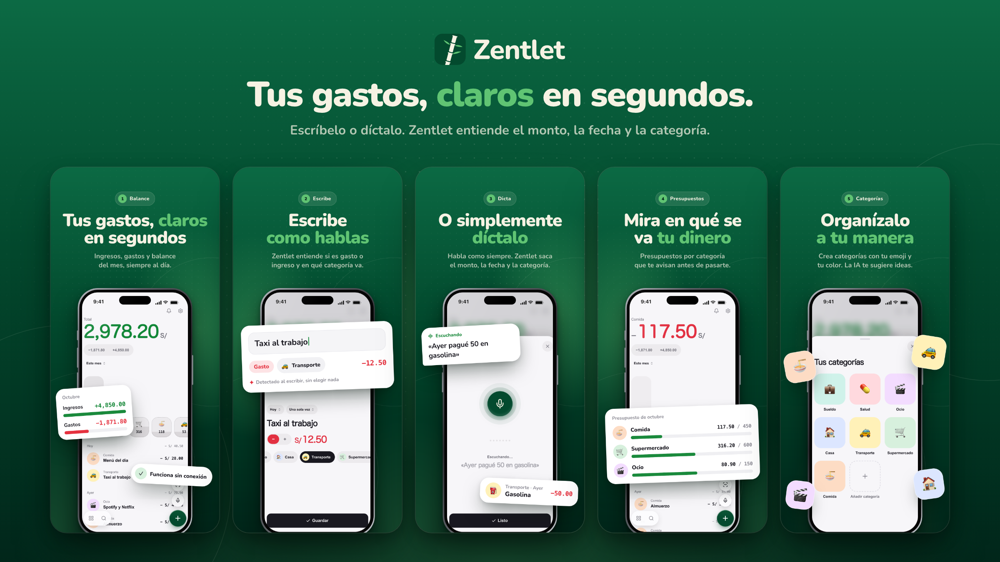

<div align="center">


# Zentlet

### Tus gastos, claros en segundos.

Escribe **«taxi al trabajo»** o dilo en voz alta, y Zentlet entiende si es gasto o ingreso y en qué categoría va.<br/>
Tu balance del mes se actualiza al momento, también sin conexión. Sin hojas de cálculo. Sin fórmulas.

<br/>

[](https://nextjs.org)
[](https://react.dev)
[](https://www.typescriptlang.org)
[](https://tailwindcss.com)
[](https://heroui.com)
[](https://tanstack.com/query)
[](https://zod.dev)
[](https://www.postgresql.org)
[](https://www.prisma.io)
[](https://www.better-auth.com)
[](https://ai.google.dev)
[](https://www.mercadopago.com.pe/developers)
[](https://resend.com)
[](https://www.cloudflare.com/products/turnstile/)
[](https://sentry.io)
[](https://posthog.com)
[](https://vitest.dev)
[](https://playwright.dev)
[](https://www.docker.com)
[](https://vercel.com)
[](.github/workflows/ci.yml)

<br/>



<br/>

[**Funciones**](#-funcionalidades) · [**Capturas**](#-capturas) · [**Instalación**](#-instalación)

</div>

<br/>

## ✦ El problema

Las hojas de cálculo se abandonan en la segunda semana. Anotar un gasto exige abrir un archivo, buscar la fila, elegir la categoría y escribir la fórmula, así que acaba sin anotarse.

**Zentlet está hecho para que anotar un gasto sea más rápido que olvidarlo.** Escribes o dictas el gasto como lo dirías, y la app completa el tipo, la fecha y la categoría por ti.

<br/>

## 🌟 Funcionalidades

- **⌨️ Escribe como hablas:** «taxi al trabajo» y detecta si es gasto o ingreso y su categoría.
- **🎙️ Dictado por voz:** saca monto, fecha y categoría de lo que dices, en español o inglés.
- **🧾 Escaneo de comprobantes:** boletas, vouchers o capturas de Yape/Plin, por QR de SUNAT, OCR o IA.
- **✨ Categoría sugerida por IA:** Gemini propone la categoría entre las tuyas cuando el texto no basta.
- **📊 Resumen del mes:** balance, ingresos, gastos y reparto por categoría, con filtro y búsqueda.
- **🎯 Presupuestos con alertas:** topes de semanal a anual, con avisos por porcentaje o monto.
- **🔔 Notificaciones:** te avisa cuando te acercas al tope de un presupuesto o lo pasas.
- **🔁 Movimientos recurrentes:** sueldo, alquiler o suscripciones que se registran solos.
- **📬 Avisos de tu banco** <sup>beta</sup>**:** reenvía los correos del banco y confírmalos en la app.
- **🎨 Categorías propias:** con tu emoji y tu color, y sugerencias de la IA.
- **📴 Sin conexión:** registra, edita y borra sin internet; se sincroniza al volver la red. Se instala como app (PWA).
- **💱 Moneda e idioma:** soles, dólares, euros o pesos; en español o inglés.
- **📤 Exportar a Excel** y eliminar tu cuenta cuando quieras.
- **🔐 Acceso seguro:** correo con verificación, Google o GitHub.

<br/>

## 📸 Capturas

<div align="center">










</div>

<br/>

## 🚀 Instalación

**Con Docker:**

```bash
git clone https://github.com/cesarcunyarache/zentlet-next.git
cd zentlet-next
docker compose up           # http://localhost:3000
```

**Sin Docker** (Node.js 24, pnpm y PostgreSQL):

```bash
git clone https://github.com/cesarcunyarache/zentlet-next.git
cd zentlet-next
pnpm install
cp .env.example .env        # rellena los valores
pnpm prisma migrate dev
pnpm dev
```

<br/>

<div align="center">

**Zentlet<span>.</span>** · Hecho para que anotar sea más rápido que olvidar.

</div>
